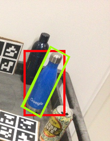

# MSL-RAPTOR back-end C++ implementation

This repository contains a C++ re-implementation of the back-end of [MSL-RAPTOR](https://arxiv.org/pdf/2012.09264). It is more efficient than the original code, but does not contain the front-end presented in the work.

MSL-RAPTOR was presented at the [ISER 2020](http://iser2020.org/), and a recording of the presentation describing the work can be found [here](https://youtu.be/CAAZY7YuM3Q?t=3399).

The implementation heavily relies on the SR-UKF [implementation provided by sxyu](https://github.com/sxyu/Quaternion-SR-UKF).

# Introduction

## What this repository provides

This repository provides ONLY the back-end implementation of MSL-RAPTOR, which is a specific application of an Unscented Kalman Filter (UKF) in which the state contains a 6 degrees of freedom (DoF) pose, and the measurement is a 2D bounding box.

It is expected that front-end measurements are provided by the user in the form of 2D bounding boxes. This is because the front-end might vary depending on the use of MSL-RAPTOR, in particular on objects to track and available hardware.

## How it is provided

The implementation is provided as a C++ header file located in [include/msl_raptor_backend.h](include/msl_raptor_backend.h).
To use the MSL-RAPTOR back-end in your own project, you can include the files in your project and work with the [`MSLRaptorUKF`](<(https://github.com/bramtoula/MSL-RAPTOR-Backend/blob/main/include/msl_raptor_backend.h#L364)>) class.

An example of usage of the library is provided in [msl-raptor-example.cpp](msl-raptor-example.cpp), with usage described [below](#running-the-example).

The usage of a SR-UKF rather than a UKF allows better efficiency in the implementation.

# Dependencies

- Eigen 3 (3.3+ should work)
- C++ 11 (but not 14) support
- CMake
- OpenCV

# Usage

To make use of MSL-RAPTOR in your project with this back-end implementation, the following need to be provided:

- A source of front-end measurements (2D bounding boxes)
- Camera intrinsic and extrinsic parameters
- Object shape approximation (dimensions or list of 3D points on its surface)
- UKF parameters

Once all those have been provided, an instance of [`MSLRaptorUKF`](https://github.com/bramtoula/MSL-RAPTOR-Backend/blob/main/include/msl_raptor_backend.h#L364) can be initialised. Consecutive front-end measurements can be given to update the filter and create new pose estimates.

Below is a high-level example of what this could look like, without going into the detailed options for each aspect. The details and options are discussed after.

```
#include "msl_raptor_backend.h"                                 // Include the library
const bool aligned_bb = false;                                  // Set the type of bounding box used, here angled
msl_raptor_backend::ObjParams obj_params( ... );                // Fill in object parameters
msl_raptor_backend::CameraParams cam_params( ... );             // Fill in camera parameters
MSLRaptorUKF<aligned_bb>::StateVec init_state;                  // Create initial state

MSLRaptorUKF<aligned_bb> msl_raptor_ukf(obj_params, cam_params, // Initialise MSL-RAPTOR UKF
                                        init_state);

while(true){                                                    // Main loop during which to perform tracking
    MSLRaptorUKF<aligned_bb>::MeasureVec m = ...                // Get measurement from front-end
    dt = ...                                                    // Get time since previous measurement
    msl_raptor_ukf.update(dt, m);                               // Update MSL-RAPTOR backend state
    msl_raptor_ukf.getState()                                   // Get current state estimate
}
```

## Example usage

An example of usage with hand-made dummy values is provided in [msl-raptor-example.cpp](msl-raptor-example.cpp).

### Running the example

To run the example, perform the following steps:

```
mkdir build && cd build
cmake ..
cmake --build . --config Release
./msl-raptor-example
```

You should see the printouts generated in the example code.

_Note_
If Eigen isn't found automatically when running `cmake ..`, you may need

```
cmake .. -DEIGEN_INCLUDE_DIRS="path/to/eigen/includes"
```

## Usage details

### MSL-RAPTOR UKF state

The state of MSL-RAPTOR UKF contains the pose and velocities of the object that is tracked.
This is represented in a vector with 13 values, in the following order:

- 3 for position
- 3 for linear velocity
- 3 for the angular velocity
- 4 for a quaternion representing orientation

More details on how to work with the state vector can be found in the [README of the repository this is based on](https://github.com/sxyu/Quaternion-SR-UKF).

In MSL-RAPTOR, we are mostly interested in the pose (position and orientation). The velocity in the state helps track the pose, but we did not evaluate its accuracy.

### Front-end measurements

Front-end measurements are provided to the UKF at each update step. They can be either axis-aligned bounding boxes, or angled bounding boxes.
Axis-aligned bounding boxes have four values expressed in number of pixels:

```
center_x center_y width height
```

Angled bounding boxes add a fifth value for the angle, which is expressed in radians (0 corresponds to an axis-aligned box):

```
center_x center_y width height angle
```

<p align="center">
  
</p>

The `MSLRaptorUKF` is templated on a `is_aligned_bb` boolean which indicates whether the measurements will be axis-aligned or angled bounding boxes.

```
MSLRaptorUKF<true> msl_raptor_ukf( ... )    // Will use aligned bounding boxes
MSLRaptorUKF<false> msl_raptor_ukf( ... )   // Will use angled bounding boxes
```

Measurement vectors are expected to be used in a [`MSLRaptorUKF<aligned_bb>::MeasureVec`](https://github.com/bramtoula/MSL-RAPTOR-Backend/blob/main/include/msl_raptor_backend.h#L375), which are themselves a [`kalman::Vector`](https://github.com/bramtoula/MSL-RAPTOR-Backend/blob/main/include/UKF.h#L137).

The way to obtain front-end measurements is up to the user, depending on the task. One solution could be to use a neural network to do bounding box predictions in Python (e.g. with the [detectron2](https://github.com/facebookresearch/detectron2) library), and publish them in [ROS](https://www.ros.org/) messages which can then be used in C++ and shared with the MSL-RAPTOR UKF.

### Camera parameters

The filter expects knowledge of the camera intrinsic and extrinsic parameters.
A [`CameraParams`](https://github.com/bramtoula/MSL-RAPTOR-Backend/blob/main/include/msl_raptor_backend.h#L43) structure is provided under the `msl_raptor_backend` to gather all camera parameters.

There are several ways to create the camera parameters that are provided when initialising the filter, or to update its intrinsics and/or extrinsics in the `CameraParams` structure in [msl_raptor_backend.h](include/msl_raptor_backend.h).
All possibilities can be found in the various constructors functions:

- ([constructor](https://github.com/bramtoula/MSL-RAPTOR-Backend/blob/main/include/msl_raptor_backend.h#L198)) Using camera parameter values directly
- ([constructor](https://github.com/bramtoula/MSL-RAPTOR-Backend/blob/main/include/msl_raptor_backend.h#L208)) Using an OpenCV camera matrix
- ([constructor](https://github.com/bramtoula/MSL-RAPTOR-Backend/blob/main/include/msl_raptor_backend.h#L215)) Using vectors for all parameters

There also are functions to update specific camera parameters: `updateIntrinsics` ([a](https://github.com/bramtoula/MSL-RAPTOR-Backend/blob/main/include/msl_raptor_backend.h#L124), [b](https://github.com/bramtoula/MSL-RAPTOR-Backend/blob/main/include/msl_raptor_backend.h#L138), [c](https://github.com/bramtoula/MSL-RAPTOR-Backend/blob/main/include/msl_raptor_backend.h#L146)) and `updateExtrinsics` ([a](https://github.com/bramtoula/MSL-RAPTOR-Backend/blob/main/include/msl_raptor_backend.h#L156),[b](https://github.com/bramtoula/MSL-RAPTOR-Backend/blob/main/include/msl_raptor_backend.h#L172), [c](https://github.com/bramtoula/MSL-RAPTOR-Backend/blob/main/include/msl_raptor_backend.h#L188)).

### Object properties and UKF parameters

Similarly to the camera parameters, an [`ObjParams`](https://github.com/bramtoula/MSL-RAPTOR-Backend/blob/main/include/msl_raptor_backend.h#L263) structure is provided under the `msl_raptor_backend` namespace to provide parameters associated to the the object for which we want to track the pose.

These contain parameters relating to the physical properties of the object, as well as UKF parameters that are specific to each object.

Again, a few options to provide shape information are provided in the various constructors in the `ObjParams` structure in [msl_raptor_backend.h](include/msl_raptor_backend.h):

- ([constructor](https://github.com/bramtoula/MSL-RAPTOR-Backend/blob/main/include/msl_raptor_backend.h#L281)) With a point cloud containing points on the surface of the object expressed in the frame of reference of the tracked object
- ([constructor](https://github.com/bramtoula/MSL-RAPTOR-Backend/blob/main/include/msl_raptor_backend.h#L293)) With the width, height, and depth of the object. In that case, corners of a 3D bounding box will be used as a shape approximation.

The UKF parameters required are the standard covariance, process noise, and measurement noise values. Currently, only diagonal matrices are supported, and only the values in the diagonals are expected.
Values used in the original implementation for the paper can be found [here](https://github.com/StanfordMSL/MSL-RAPTOR/tree/master/params/category_params). They can be a good starting point for other objects, and will likely still require some tuning.

Finally, an [`ObjPoseInitParams`](https://github.com/bramtoula/MSL-RAPTOR-Backend/blob/main/include/msl_raptor_backend.h#L224) instance is also expected to create an `ObjParams`. This was used experimentally to approximate the 6D pose from a single bounding box measurement using optimisation. It contains the optimisation parameters (step size, number of steps, etc.), but is only used if you want to use the [`approxStatePoseOptimFromInit`](https://github.com/bramtoula/MSL-RAPTOR-Backend/blob/main/include/msl_raptor_backend.h#L650) or [`approxStatePoseOptimSingleThread`](https://github.com/bramtoula/MSL-RAPTOR-Backend/blob/main/include/msl_raptor_backend.h#L669) functions (see next topic).

### Initial state

When initialising the UKF, an initial state must be set.

There are several constructors allowing three options:

- ([constructor](https://github.com/bramtoula/MSL-RAPTOR-Backend/blob/main/include/msl_raptor_backend.h#L862)) Initial state filled with zeros and real quaternion, by providing no initial state.
- ([constructor](https://github.com/bramtoula/MSL-RAPTOR-Backend/blob/main/include/msl_raptor_backend.h#L871)) Initial state provided, by giving a [`MSLRaptorUKF<aligned_bb>::StateVec`](https://github.com/bramtoula/MSL-RAPTOR-Backend/blob/main/include/msl_raptor_backend.h#L371), which is itself a [`kalman::Vector`](https://github.com/bramtoula/MSL-RAPTOR-Backend/blob/main/include/UKF.h#L137).
- ([constructor](https://github.com/bramtoula/MSL-RAPTOR-Backend/blob/main/include/msl_raptor_backend.h#L879)) Initial state approximated heuristically from a single initial 2D bounding box [measurement](#front-end-measurements). The code for the heuristic approximation can be found [here](https://github.com/bramtoula/MSL-RAPTOR-Backend/blob/main/include/msl_raptor_backend.h#L420) and [here](https://github.com/bramtoula/MSL-RAPTOR-Backend/blob/main/include/msl_raptor_backend.h#L456). It makes assumptions on the orientation of the object to guess the distance using the bounding box size and object dimensions.

### Initial state - Optimisation search of pose from single bounding box measurement

We also experimented with an optimisation approach to look for the best pose guess given a single 2D bounding box measurement. This can be found [here](https://github.com/bramtoula/MSL-RAPTOR-Backend/blob/main/include/msl_raptor_backend.h#L650) and [here](https://github.com/bramtoula/MSL-RAPTOR-Backend/blob/main/include/msl_raptor_backend.h#L669).
These functions can be used to provide a more accurate state vector guess from a single bounding box than the heuristic approximation.

The idea is to iteratively update the state following a numerical gradient approximation of bounding box measurement errors. Given a current pose, a bounding box prediction can be computed using camera and object parameters. This is actually what the [measurement prediction function](https://github.com/bramtoula/MSL-RAPTOR-Backend/blob/main/include/msl_raptor_backend.h#L741) of the UKF does.

We approximate the gradient by evaluating how small pose changes affect the bounding box prediction error.

Several initial poses can be tested as well, with only the best final pose guess being returned.

The parameters of the optimisation search (such as step sizes, initial pose guesses, etc.) are taken from the [`ObjPoseInitParams`](https://github.com/bramtoula/MSL-RAPTOR-Backend/blob/main/include/msl_raptor_backend.h#L224) that are saved in the [`ObjParams`](https://github.com/bramtoula/MSL-RAPTOR-Backend/blob/main/include/msl_raptor_backend.h#L263) of the UKF.

### Stepping through the UKF

With the MSL-RAPTOR UKF properly initialised, all that is left is to update it when new measurements are provided!

This is done with the [`update`](https://github.com/bramtoula/MSL-RAPTOR-Backend/blob/main/include/msl_raptor_backend.h#L832) function:

```
msl_raptor_ukf.update(dt, measurement_vector);        // Without an input
msl_raptor_ukf.update(dt, measurement_vector, input); // With an input (e.g. odometry)

```

The parameters are:

- `dt`, a double containing the time in seconds since the last state update of the UKF
- `measurement_vector`, a [MSLRaptorUKF<aligned_bb>::MeasureVec](#front-end-measurements) describing a 2D bounding box
- (optional) `input`, a transformation matrix to apply to the pose that can be provided if there is knowledge of how the pose of the object might have changed since the last measurement. For example, this can come from the odometry of the ego robot.

The curent estimate can be obtained by reading the state of the UKF:

```
msl_raptor_ukf.getState()
```

The covariance matrix can be obtained as well:

```
msl_raptor_ukf.getStateRootCov()
```

# Credits

This implementation is based on an [SR-UKF implementation provided by sxyu](https://github.com/sxyu/Quaternion-SR-UKF).
Significant parts of their original implementation are based on [sfwa/ukf](https://github.com/sfwa/ukf). Publications referenced include:

- Kraft, "A Quaternion-based Unscented Kalman Filter for Orientation Tracking", 2003
- Van der Merwe and Wan, "The Square-root Unscented Kalman Filter for state and Parameter-estimation", 2001
- Wan and Van der Merwe, "The Unscented Kalman Filter for Nonlinear Estimation", 2000
- Markley, "Attitude Error Representations for Kalman Filtering", 2002

# Citation

If you find this work helpful, please consider citing our paper.

```
@inproceedings{MSL-RAPTOR2021,
  address   = {Cham},
  author    = {Ramtoula, Benjamin
               and Caccavale, Adam
               and Beltrame, Giovanni
               and Schwager, Mac},
  booktitle = {Experimental Robotics},
  editor    = {Siciliano, Bruno
               and Laschi, Cecilia
               and Khatib, Oussama},
  isbn      = {978-3-030-71151-1},
  pages     = {520--532},
  publisher = {Springer International Publishing},
  title     = {MSL-RAPTOR: A 6DoF Relative Pose Tracker for Onboard Robotic Perception},
  year      = {2021}
}
```

# Contact

For any questions, please email me at <benjamin@robots.ox.ac.uk>
